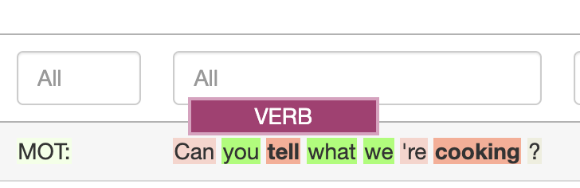

# Colour highlights

If MiMo is able to access a grammar for you language it will colour your text using different colours for different wordclasses

When you hover over the word, the word class will show in a box above the word.

The colours are designed to be meaningful. For example, all words related to the verb, e.g. verb, adverb, auxiliary verb are highlighted various shades of red / pink. I chose a bright colour because verbs are essential to sentences. There are many languages which have sentences consisting only of a verb, but few which have sentences consisting only of a noun.

## Changing the colour scheme

If you do not like the beautiful colours I have chosen, you may alter them on the `🌈 Colours` tab. Unfortunately, changes in colour do not persist across sessions, so if you close the browser, you still want to use your bespoke colours, you will need to redo them.

You can also choose sets of colours, e.g. `Verb-related words only`, or `Linking words`.