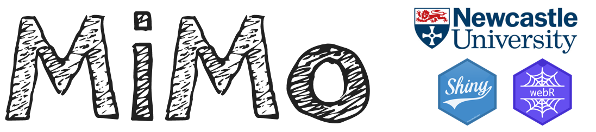
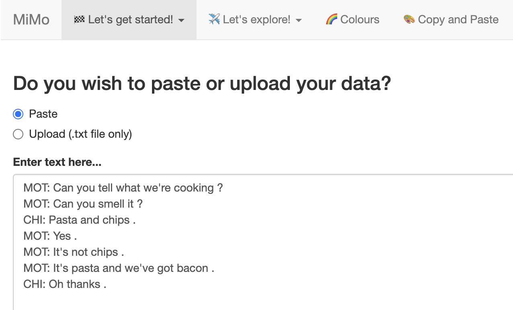
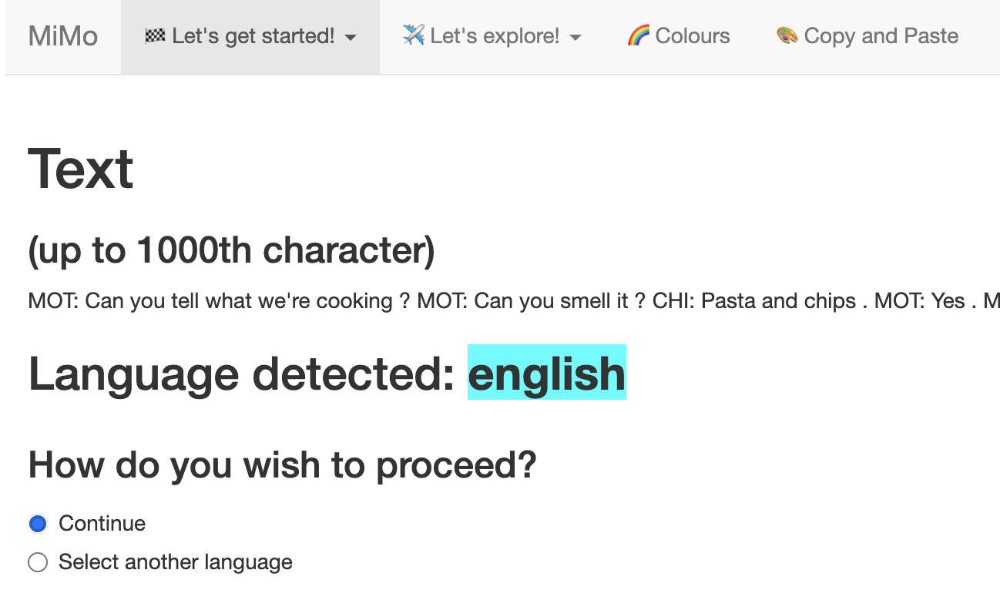
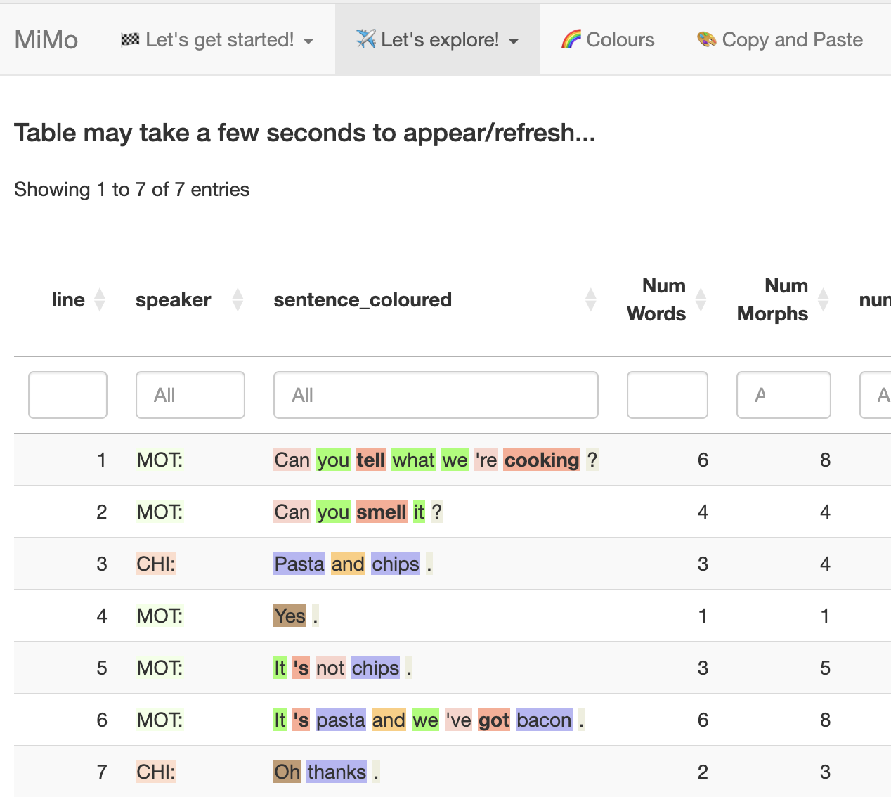

# Why I created a new app

## Finding "the sweet spot"

There are a wide range of language analysis apps designed for child language and clinical data, including [CLAN](https://dali.talkbank.org/clan/), [SALT](https://www.saltsoftware.com) and [SUGAR](https://www.sugarlanguage.org). However, none of these hits the  🍰 sweet spot between **power** and **usability**. CLAN is an impressive app, but difficult to learn, and for this reason is used mainly by the research community. SUGAR is a quick and simple system designed for Speech and Language Therapists, but the therapist still has to do some work to calculate MLU, code target structures, and derive some norms. With MiMo the plan is to "get the best of both worlds" by combining the ease and simplicity of SUGAR with the power and flexibilty CLAN.

The name MiMo describes the philosophy of the app. "Mi" refers to **minimal inputs**. In other words, the app is easy to use, and requires very little training. "Mo" refers to **maximal outputs**. This refers to the rich data produced by the app, including 🌈 coloured word classes, and 📉 graphs of norms.

## Making language analysis fun 😁!

Many apps for language analysis are quite mechanical in the way they work. You feed text in, and they produce a range of numerical metrics. There is little room for intellectual curiosity or intuition.

MiMo, buy contrast, allows the user to explore their data. You can quickly and easily search for particular word classes, or grammatical phenomena. You can quickly identify the longer and more complex structures that a participant produces. You can sort alphabetically to find rote-learned patterns that an individual is particularly dependent on. And these are just some of the things you can do!

# So how do I get started?

It's simple! Just go to the [https://mimolanguageanalysis.uk](https://mimolanguageanalysis.uk) to run the analysis app, and go to this website to run the norms app (norms provided by CHILDES / Talkbank).

You can run a simple analysis in just a couple of minutes. Here is a video showing how to get up-and-running.



And here is a description of the steps shown in the video.

**1. copy the text below**

```{txt}
MOT: Can you tell what we're cooking ?
MOT: Can you smell it ?
CHI: Pasta and chips .
MOT: Yes .
MOT: It's not chips .
MOT: It's pasta and we've got bacon .
CHI: Oh thanks .
```

**2. Open the analysis app.**
**3. Paste the text in the window.**

{width=300}

**4. Then go to "check language". It recognises the text as English.**

{width=300}

**5. Now go to the ... tab, and you will see a colour-coded output.**

{width=300}

::: {.warning}
The app may take up to half a minute to start
:::

# Is this free?

Absolutely. The apps and website are hosted in github pages. And if you know how to use R, you can just download the code and run it on your computer.

# How do I learn more?

Just carry on reading!

Use the handy navigation menu on the left to move between sections, and the page navigation menu on the right to move between sections in a page.

You can also use the search bar on the top left to find topics.