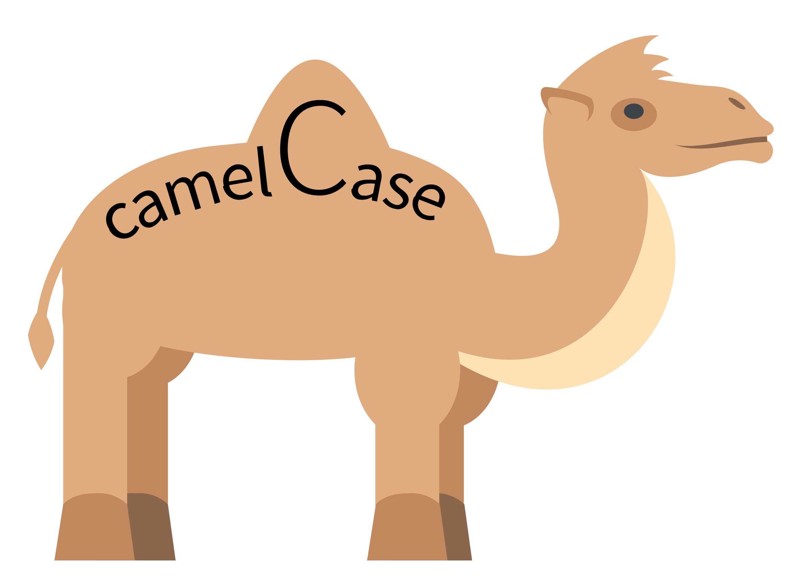

# Transcribing data

## Use of standard orthography

MiMo is designed to work with **Minimal Input**. So all you need to do is transcribe using standard orthography (Roman Alphabet).

## Sentence-final punctuation

Every line should end with an **sentence-final punctuation**, e.g. a full stop (.), question mark (?), or exclamation mark (!). MiMo uses sentence-final punctuation to determine when a sentence / utterance ends, and a new one begins. So including sentence-final punctuation is critical

## Showing speakers

**Speakers** should be shown with a series of letters followed by a colon (:). There should be no spaces, or punctuation characters. So you could type `FAT:`, `FATHER:`, `Father:`, `FATHEROFCHILD:`, `FatherOfChild:`

If you would like to include multiple words in the speaker name, you could use "camel case"



## Punctuation

Use **standard punctuation**. Show contractions with an apostrophe, e.g. `we're having fun`, `I've eaten already`. This will analyse `we're` as a single word containing two morphemes. If you want MiMo to analyse as two words you would need to write the words out in full, e.g. `we are`.

You can add other types of punctuation, e.g. commas and dashes. They will be ignored when conducting the linguistic analysis.

## Return characters

MiMo does not pay attention to return ⏎ characters. So, the following text fragment, which contains lots of return characters

```{text}
MOT: Can you tell what we're cooking ? ⏎ 
MOT: Can you smell it ? ⏎ 
CHI: Pasta and chips . ⏎ 
MOT: Yes . ⏎ 
MOT: It's not chips . ⏎ 
MOT: It's pasta and we've got bacon . ⏎ 
CHI: Oh thanks . ⏎ 
```

will be treated the same as the following text fragment where the same text is written on a single line.


`MOT: Can you tell what we're cooking ? Can you smell it ? CHI: Pasta and chips . MOT: Yes . It's not chips . MOT: It's pasta and we've got bacon . CHI: Oh thanks .`

Note that it's not necessary to always specify the speaker. If no speaker is specified at the beginning of the sentence, then MiMo will assume that the sentence is a continuation of the conversational turn of the previous speaker. This should greatly help to simplify transcription.

## Comments

If you want to include text which does not belong to a speaker you can use comments. These involve placing text inside **round brackets**, as in the example above. MiMo will not assign word classes to text in round brackets, and will not include this text in the various metrics which it calculates (Mean Length of Utterance, and various lexical metrics)
